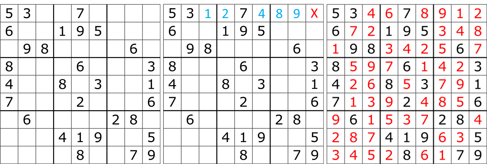

# Backtracking Sudoku Solver

A sudoku solver which finds the solution using backtracking, a brute force search method which utilises depth first search. 

Below is an example sudoku puzzle with its corresponing solution. To find a solution the algorithm places the lowest legal number in the first empty space of the top row, 1 in this case. Next it looks at the second empty space, repeating this process it places 2. The algorithm repeats this process until it finds a solution or an empty space with no possible value. In this example this occurs at the last empty space on the first row (shown by the red X). At which point the algorithm *backtracks* to the last space with multiple options, the space with the blue 8 in this case and tries with the next legal value, which is 9 here. This is repeated until a solution is found or all posible values are tried. 

The completed sudoku is shown in the third image.

An example of solving a sudoku by backtracking from wikipedia.

![alt text][solving_gif]

## Usage 

**sudoku_solver** is the main function.

Solves a Sudoku puzzle and returns its unique solution.

&nbsp;&nbsp;&nbsp;&nbsp;Args:

&nbsp;&nbsp;&nbsp;&nbsp;&nbsp;&nbsp;&nbsp;&nbsp;sudoku: 9x9 numpy array, empty cells are designated by 0.

&nbsp;&nbsp;&nbsp;&nbsp;Returns:

&nbsp;&nbsp;&nbsp;&nbsp;&nbsp;&nbsp;&nbsp;&nbsp;solution: 9x9 numpy array of integers. It contains the solution, if there is one. If there is no solution, all array entries should be -1.

[solving_gif]: https://github.com/JSaunders97/backtracking-sudoku-solver/blob/master/Sudoku_solved_by_bactracking.gif "By Simpsons contributor - Program written in Java, letter images made in Photoshop, CC BY-SA 3.0, https://commons.wikimedia.org/w/index.php?curid=29034832"
